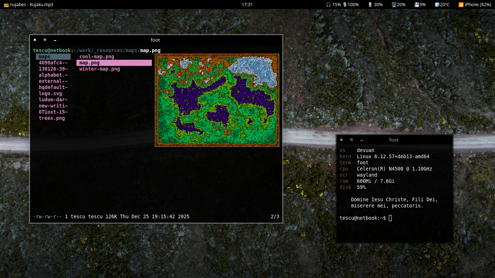

# dots

Configuration files and other utilities I have written for convenience.

### screenshot

### dependencies

* main: openbox, tint2, qterminal, hsetroot, rofi, dmenu, fzf, brightnessctl, maim, libnotify-bin (notify-send), dunst, pasystray, pactl

* extra: mpv, nsxiv, lf, chafa, w3m, pcmanfm-qt, jtmpfs

### file structure

All shell scripts are stored in the `bin/` folder. Additional files (shared files, configurations) are to be stored in `etc/`.
This maps to `~/.local/bin` and `~/.local/etc` on my system.

### keybinds

M: Super key/Mod4
A: Alt key
S: Shift key

| keybind   | action          |
|-----------|-----------------|
| M+Return  | terminal        |
| M+S+c     | close window    |
| M+S+r     | restart         |
| M+d       | program launcher|
| M+1..4    | go to desktop   |
| M+S+1..4  | send to desktop |
| M+w       | openbox menu    |
| M+e       | file manager    |
| M+f       | maximize        |
| M+S+f     | unmaximize      |
| M+x       | no decorations  |
| M+o       | change wall.    |
| M+u       | emoji menu      |
| M+S+u     | lenny faces     |
| M+m       | mount drives    |
| M+S+m     | unmount         |
| M+p       | screenshot      |
| M+S+p     | scr. window     |
| M+j       | snap left       |
| M+k       | snap right      |

### scripts

Some scripts you may find interesting/cool are:

* `mpl` & `mplc`: mpv-based music player that plays random songs in a given directory

* `psalmi`: display a random psalm in the terminal (in Romanian, but should work with any language, so long the file is formated in the same tsv format)

* `fetch`: KISS screenfetch clone

* `pickerm`: program used to select emojis, lenny faces, and even bookmarks!

* `bmadd`: writes the content of your clipboard into a bookmark file

* `wpmenu`: set your wallpaper using nsxiv

* `dexcli`: gets a definition from [dex.ro](https://dex.ro) on the terminal

### licenses

All shell scripts, source code, and configuration files are licensed under
Creative Commons [CC BY-SA 4.0](https://creativecommons.org/licenses/by-sa/4.0/deed.en).

Wallpaper image by [Jebulon](https://commons.wikimedia.org/wiki/User:Jebulon), on [Commons](https://commons.wikimedia.org/wiki/File:Holy_Apostles_church_ancient_agora_from_Acropolis_Athens.jpg).
